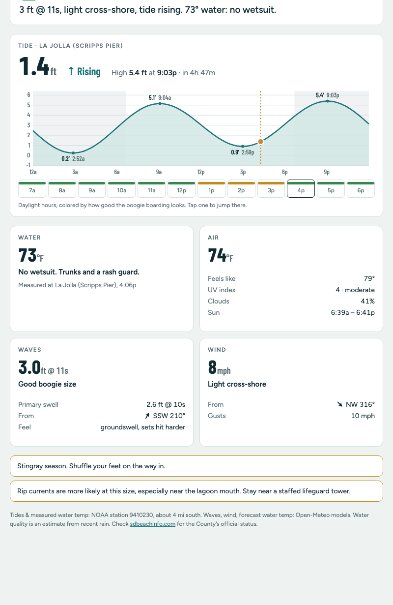

# Torrey Pines North Boogie Check

A one-page, phone-friendly check of whether it's worth grabbing the boogie board and heading to Torrey Pines State Beach North, and whether to bring a wetsuit.

**Live:** https://bookchiq.github.io/torrey-boogie-check/



It opens on right now and refreshes every 5 minutes. Pick any time from about a week ago to a week ahead, step by an hour, or tap an hour in the daylight strip. For that time it shows:

- **A verdict:** Go, Maybe or Skip it, with a one-line summary.
- **Tide:** current height, rising or falling, the next high or low, and a curve for the whole day with night shaded.
- **Water temperature**, with a wetsuit call (none, rash guard, spring suit, 3/2, 4/3, 4/3 plus booties).
- **Air:** temperature, feels-like, UV, cloud cover, sunrise and sunset.
- **Waves:** height, period, primary swell size and direction, and whether that's a good size for boogie boarding.
- **Wind:** speed, gusts, and whether it's onshore, offshore, cross-shore or glassy for the way this beach faces.
- **Weather service alerts:** when the National Weather Service has a Beach Hazards Statement, High Surf Advisory, Rip Current Statement or another alert in effect for the beach, an orange banner appears at the top. Tap it for the full text.
- **Heads-ups when they apply:** rain in the past 72 hours (water quality), stingray season, rip currents, a narrow beach at high tide, strong UV, and daylight running out.

It's a single `index.html` with no build step, no dependencies, and no API keys.

## Make it your beach

You'll need about 15 minutes and a GitHub account.

### 1. Copy the repo

Click **Use this template** or **Fork** on GitHub. Or clone it and push it to a new repo of your own.

### 2. Edit the `BEACH` block

Everything specific to one place is in a single object at the top of the `<script>` in [`index.html`](index.html):

```js
const BEACH = {
  name: 'Torrey Pines North',
  lat: 32.933, lon: -117.265,
  timeZone: 'America/Los_Angeles',
  facing: 255,
  station: '9410230',
  stationName: 'La Jolla (Scripps Pier)',
  stationNote: 'about 4 mi south',
  highTideFt: 5,
  shore: [32.9335, -117.2585],
  waterQuality: { url: 'https://www.sdbeachinfo.com/', label: 'sdbeachinfo.com', agency: 'the County' },
  notes: {
    rain: 'the Los Peñasquitos Lagoon mouth drains right onto North Beach.',
    highTide: 'not much dry sand near the cliffs. Keep your stuff up by the lot end.',
    rip: 'especially near the lagoon mouth.',
    stingrayMonths: [5, 10]
  }
};
```

| Field | What to put there | How to find it |
| --- | --- | --- |
| `name` | What you call your spot. It's also used for the page title. | — |
| `lat`, `lon` | A point **just offshore** of where you paddle out, about 200–500 m out. | Right-click the water in Google Maps and copy the coordinates. A point on land can come back with no wave data, because the wave model only covers the ocean. |
| `timeZone` | The beach's IANA time zone, like `America/New_York` or `Pacific/Honolulu`. | [List of zones](https://en.wikipedia.org/wiki/List_of_tz_database_time_zones) |
| `facing` | The compass bearing the beach looks out to sea: 0 = north, 90 = east, 180 = south, 270 = west. Wind blowing *from* this direction is onshore. | In Google Maps, stand on the sand facing the water and estimate the bearing. A rough answer (±20°) is fine. |
| `station` | A NOAA CO-OPS station ID for tide predictions. | Search the [NOAA Tides & Currents map](https://tidesandcurrents.noaa.gov/map/) for the closest station. The ID is the 7-digit number. |
| `stationName`, `stationNote` | How the station is labeled on the page, and how far it is from your beach. | — |
| `highTideFt` | The tide height (ft above MLLW) where your beach starts to get narrow. | Local knowledge. Set it high, like `99`, to never show that note. |
| `shore` | A point **on the sand**, as `[lat, lon]`, used to find weather alerts. US only; set it to `null` elsewhere. | Right-click the beach itself in Google Maps. It has to be on land: NWS issues beach alerts for land forecast zones, and an offshore point lands in a marine zone that doesn't get them. The page looks up the zone for you. |
| `waterQuality` | Where to check the official water-quality status for your area. | Your county or state health department's beach page. In the US, many are listed at the [EPA BEACON site](https://beacon.epa.gov/). |
| `notes.rain`, `.highTide`, `.rip` | Optional local detail added to those heads-ups. Set any of them to `''` to show just the generic text. | — |
| `notes.stingrayMonths` | The first and last month of stingray season, like `[5, 10]` for May–October. Use `null` to turn the note off. | — |

**Water temperature:** if your NOAA station has a water temperature sensor, the page shows the measured reading for now and the past week. If it doesn't, or for future times, it uses a forecast model instead. To check whether a station has a sensor, open its page on tidesandcurrents.noaa.gov and look for "Water Temperature" under the station's data. If yours has tides but no temperature sensor, everything still works.

**Icon (optional):** `favicon.svg` is the browser-tab icon, a wave and sun. `apple-touch-icon.png` (180×180, square, no transparency) is what your phone's home screen shows. The name under the home-screen icon comes from the `apple-mobile-web-app-title` tag in `<head>`.

### 3. Try it locally

The page needs to be served over `http://`, not opened as a file, so the browser allows the data requests:

```bash
python3 -m http.server 8000
```

Then open http://localhost:8000.

### 4. Publish on GitHub Pages

In your repo, go to **Settings → Pages**. Set **Source** to *Deploy from a branch*, choose `main` and `/ (root)`, then save. After a minute or two it's live at `https://<your-username>.github.io/<repo-name>/`.

On your phone, open that URL and choose **Add to Home Screen** so it opens like an app.

## Tune the judgement calls

The verdicts are rules of thumb for boogie boarding at a sandy beach break, written for someone who runs slightly warm. They're all short functions in `index.html`; search for these names:

| Function | What it decides | Defaults |
| --- | --- | --- |
| `suitFor` | Wetsuit by water temperature (°F) | ≥72 none · 68–71 rash guard · 64–67 spring suit · 60–63 3/2 · 56–59 4/3 · below 56 4/3 plus booties |
| `waveKind` | How good the wave height is | under 1 ft nearly flat · 1–2 small · 2–5 good · 5–7 big · 7+ too big |
| `windKind` | Wind quality from speed (mph) and direction relative to `facing` | ≤4 glassy · offshore is clean · onshore gets choppy at 8+ and blown out at 14+ |
| `tideScore` | Tide preference | Mid tide scores best. Below 1 ft or above 5 ft scores lower. |
| `rate` | Combines the three scores into Go, Maybe or Skip it. | Rain of 0.1 in or more in the past 72 hours is always Skip it. A beach-related NWS *warning* (e.g. High Surf Warning) is Skip it. A beach-related statement or advisory caps the rating at Maybe. "Beach-related" is the `BEACH_ALERT` pattern. |

If you surf or bodysurf instead, `waveKind` is the main one to change. If your beach is a reef or point break, change `tideScore` to match its best tide.

## Where the data comes from

All requests go straight from your browser to these free public APIs. There's no server in between.

- **[NOAA CO-OPS](https://api.tidesandcurrents.noaa.gov/api/prod/)**: tide predictions (6-minute curve plus highs and lows) and measured water temperature. US stations only.
- **[National Weather Service API](https://www.weather.gov/documentation/services-web-api)**: active watches, warnings and advisories for the beach's forecast zone. US only. It only lists alerts in effect *now*, so for a past or future time the page shows today's alerts only if that time falls inside the alert's start and end.
- **[Open-Meteo Forecast](https://open-meteo.com/en/docs)**: air temperature, feels-like, wind, gusts, UV, cloud cover, precipitation, sunrise and sunset.
- **[Open-Meteo Marine](https://open-meteo.com/en/docs/marine-weather-api)**: wave height and period, swell, and forecast sea surface temperature.

Open-Meteo is free for non-commercial use without a key. A personal page like this uses a few requests per visit, far below their limits.

### Outside the US?

Everything except the tides, measured water temperature and weather alerts works worldwide. Set `shore: null` to turn alerts off. For tides, you'd replace `loadTides` with another source. Open-Meteo Marine's `sea_level_height_msl` variable gives a modeled tide curve almost anywhere, though it's less precise than a station prediction. `loadTides` just needs to return `{ pts: [[timeMs, heightFt], …], hilo: [{ t, v, type: 'H' | 'L' }, …] }`.

## How the code is organized

The whole app is one IIFE in `index.html`:

- **`BEACH`**: the config block above.
- **Time helpers**: every timestamp is handled as beach-local wall-clock time (stored as `Date.UTC` of the local components). That keeps NOAA's and Open-Meteo's local-time strings lined up without time-zone math.
- **Data**: `loadModels` fetches a two-week window of weather and marine data once at startup. `loadTides` and `measuredWater` fetch NOAA data for the selected day and are cached per day. `loadAlerts` fetches NWS alerts at most every 5 minutes.
- **Judgement**: `suitFor`, `windKind`, `waveKind`, `tideScore`, `rate`.
- **Render**: `drawAlerts` (the banner), `drawChart` (the tide SVG), `drawHours` (the daylight strip), and `render` (everything else).

Light and dark themes follow your system setting through CSS variables at the top of the `<style>` block.

## Caveats

This is a quick personal check, not a safety tool. The wave and wind numbers are model forecasts for a point offshore, not observations of the break. The water-quality flag is a guess based on rainfall. Always check the official water-quality status, read the conditions when you get there, and swim near a lifeguard.
